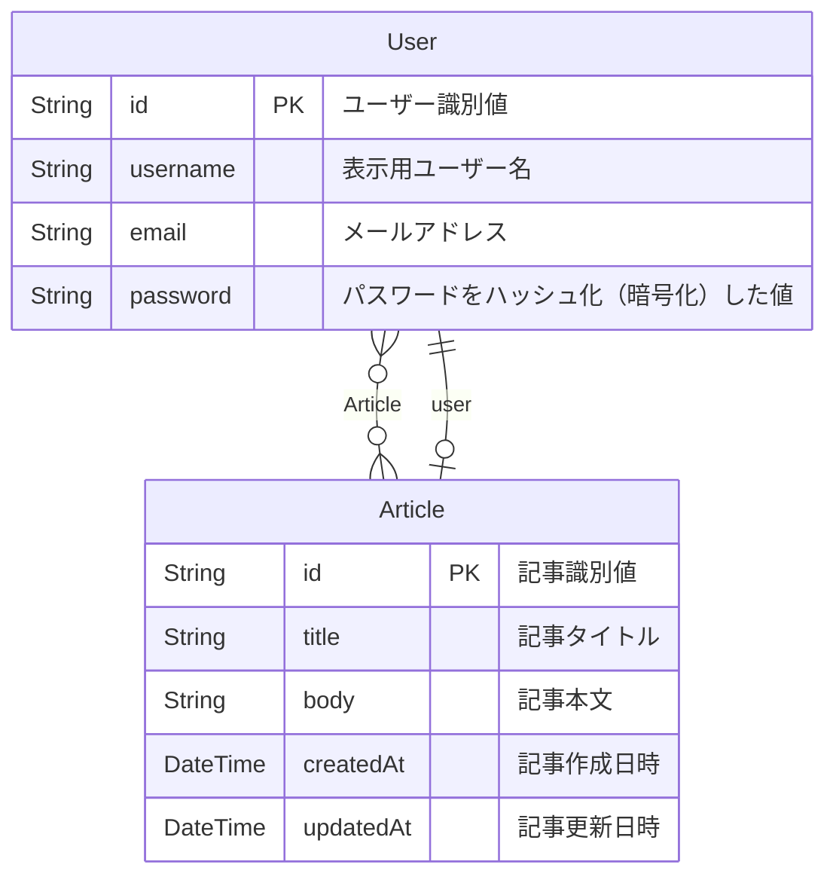

```mermaid
erDiagram

  "User" {
    String id PK "ユーザー識別値"
    String username "表示用ユーザー名"
    String email "メールアドレス"
    String password "パスワードをハッシュ化（暗号化）した値"
    }
  

  "Article" {
    String id PK "記事識別値"
    String title "記事タイトル"
    String body "記事本文"
    DateTime createdAt "記事作成日時"
    DateTime updatedAt "記事更新日時"
    }
  
    "User" o{--}o "Article" : "Article"
    "Article" o|--|| "User" : "user"
```
